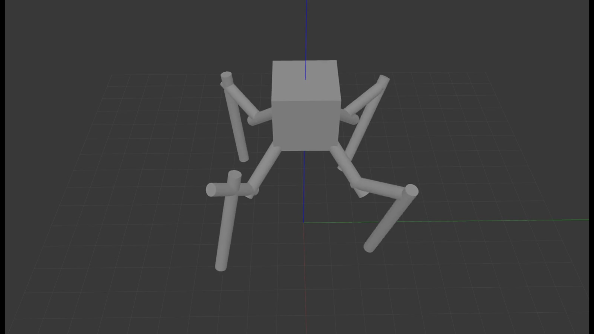

# ROS_spider_robot
> Spider robot implementation in ROS



[](https://travis-ci.com/smileyenot983/ROS_spider_robot)


## Description

robot_description:
```sh
ROS package to visualize urdf model of robot in rVIZ
```
robot_gazebo:
```sh
ROS package to visualize urdf model of robot in Gazebo simulator
```

spider_robot_control:
```sh
ROS package to control joints of robot
```

sensor_camera:
```sh
ROS package with publisher(rotating camera) and subscriber(saving images from camera)
```

integration_test:
```sh
ROS package which implements integration tests. It sends control signals to joints and checks if the error between setted and factical positions smaller than 0.01
```

unit_tests:
```sh
python script which implements forward kinematics for one leg of robot and unit tests which were designed to check forward kinematics function
```

## Running the project
* put package to src folder of your ros workspace
* write "catkin_make"(in terminal)
* write "source devel/setup.bash" (in terminal)
* write "roslaunch" + "name_of_package" + "name_of_launch_file"(for example "roslaunch robot_gazebo display.launch")
* to see how control or camera sensor  works first run model of robot in gazebo

## Running tests
* to run unit tests just look at the examples shown below, i prepared examples for each test. There is nothing hard, just call the function which contains tests
* running integration test is the same as running the package. How to run the package? Look at paragraph 'Running the project' above

